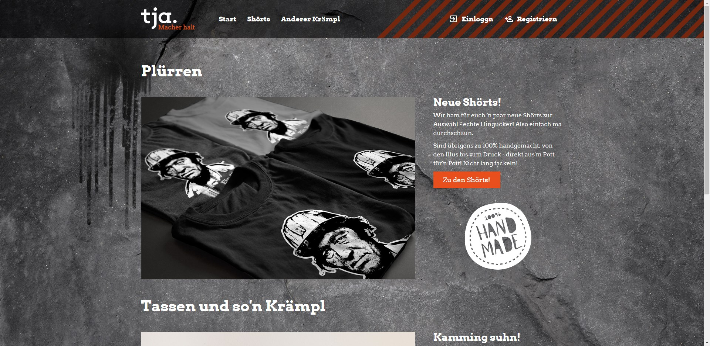
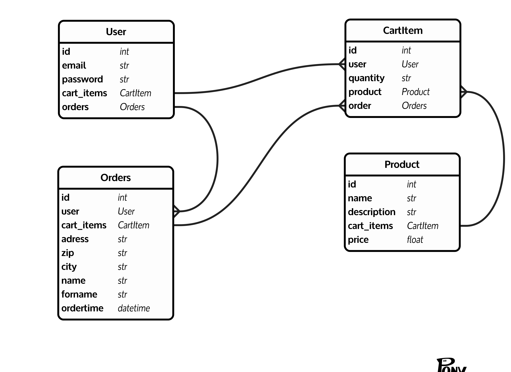

# tja!
## Ein Schulprojekt vom 14. November 2018
tja! Webshop ist ein Schulprojekt für die Berufsschule für Technik und Gestaltung. Das Projekt wurde im Rahmen des Fachs "Medienintegration und Medienausgabe" im dritten Lehrjahr durch Frau vom Hove gestellt. Es ging in dem Projekt um die Erstellung eines Webshops mit PHP Grundlage und dem Thema "Ruhrgebiet/Ruhrpott/Gelsenkirchen".

## Demo
[http://andreas-heimann.com/schule/vHove-php-webshop/](http://andreas-heimann.com/schule/vHove-php-webshop/)

## Team
* Thiemo Frömberg
* Julian Schulte
* Andreas Heimann

## Backend Stack
* PHP
* MySQL
* Apache2

## Frontend Stack
* HTML
* CSS (durch LESS generiert)
* Javascript (ES2015)

## Datenbankstruktur Modell
